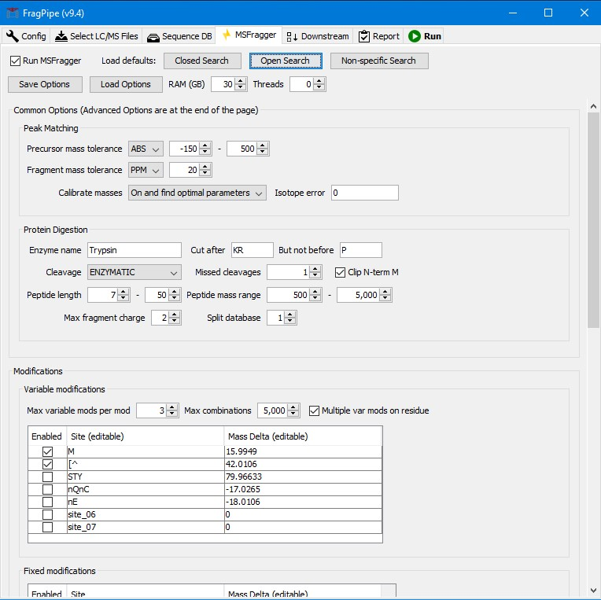

# MSFragger
MSFragger is an ultrafast database search tool for peptide identifications in mass spectrometry-based proteomics. MSFragger has demonstrated excellent performance across a wide range of datasets and applications. The speed of MSFragger makes it particularly suitable for the analysis of large datasets (including timsTOF data), for enzyme unconstrained searches, and for ‘open’ database searches (with the precursor mass tolerance set to hundreds of Daltons) for identification of modified peptides. 

MSFragger is implemented in the cross-platform Java programming language, and is available as a standalone JAR file. It is compatible with standard open file formats for mass spectrometry data (mzXML/mzML). It writes output in either tabular or pepXML formats, making it fully compatible with downstream data analysis pipelines such as Trans-Proteomic Pipeline and [Philosopher](https://nesvilab.github.io/philosopher/).

## Download MSFragger
If you never downloaded MSFragger before, please complete steps 1-3. To upgrade to the most recent version from a previously downloaded version (JAR file), skip to step 3.

1.	Complete the [license agreement form](http://inventions.umich.edu/technologies/7143_msfragger-ultrafast-and-comprehensive-identification-of-peptides-from-tandem-mass-spectra).
2.	Download the initial release of MSFragger software using instructions received by email.
3.	Once you obtained the MSFragger software, the latest version of the software can be downloaded (under the same license terms as the original version) using the [Upgrade site](https://msfragger.arsci.com/upgrader/). 

## Running MSFragger

On Windows, the easiest way to run MSFragger is using [FragPipe GUI](https://fragpipe.nesvilab.org) (Graphical User Interface).  

<br>

FragPipe includes additional tools such as Philosopher (for downstream analysis with PeptideProphet and ProteinProphet), label-free quantification, FDR filtering, and report generation (at the PSM/ion/peptide/protein-levels). It also includes DIA-Umpire SE module for DIA data and SpectraST-based spectral library building module.

<br>
<br>

To run MSFragger alone, using the command-line:
```
java -Xmx20g -jar <path to msfragger.jar file> <path to fragger.params file> <path to mzML/mzXML/MGF files>
```
`-Xmx20g` specifies the maximum memory assigned to Java virtual machine. In this example, the maximum value is 20 GB. This needs to be changed depending on the computer configuration. 

Detailed command-line options can be displayed with:
```
java -jar <path to msfragger.jar file>
```
For more information on how to run MSFragger/Philosopher tools using command-line see [Tutorial](https://github.com/Nesvilab/philosopher/wiki/Processing-Filtering-and-Analyzing-Open-Search-Results-Using-Philosopher).

When searching very large sequence databases, performing nonspecific searches, and/or specifying many variable modifications, it may be necessary to use the database splitting option in FragPipe. This option requires Python installation. If running using command-line, download a [Python script](https://raw.githubusercontent.com/Nesvilab/FragPipe/develop/MSFragger-GUI/tools/msfragger_pep_split.py) and run MSFragger using the following command:
```
python3 <path to msfragger_pep_split.py file> <num> "java -Xmx20g -jar" <path to msfragger.jar file> <path to fragger.params file> <path to mzML/mzXML/MGF files>
```
Replacing `<num>` with the number (e.g. 4) of slices for database splitting, and also changing the maxium allowed memory as described above.  

## Release Notes
The latest version of MSFragger was released on 2019-05-30.
Check [here](CHANGELOG.md) for the full list of MSFragger versions and changes.
 
## Documentation
For documentation on MSFragger itself (hardware requirements, search parameters, etc.), see MSFragger [Documentation Wiki page](https://github.com/Nesvilab/MSFragger/wiki).  

## Questions and Technical Support
Please post all questions/bug reports regarding MSFragger itself on the [MSFragger GitHub page](https://github.com/Nesvilab/MSFragger), or if more appropriate on [FragPipe page](https://github.com/Nesvilab/FragPipe) or [Philosopher page](https://github.com/Nesvilab/philosopher).

## Requests for Collaboration
If you would like to propose a new collaboration that can take advantage of MSFragger and related tools, please contact us directly. 

## How to Cite
Kong AT, Leprevost FV, Avtonomov DM, Mellacheruvu D, Nesvizhskii AI. MSFragger: ultrafast and comprehensive peptide identification in mass spectrometry-based proteomics. Nature Methods 14:513–520 (2017). [Manuscript](https://www.nature.com/articles/nmeth.4256). 

For other tools developed by Nesvizhskii lab, go to our website [www.nesvilab.org](http://www.nesvilab.org)
